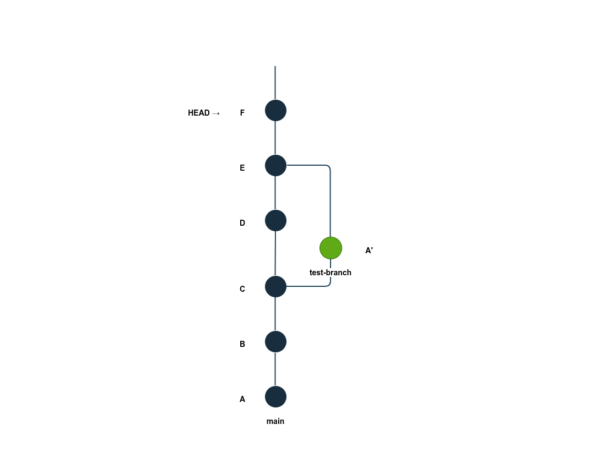

# Introduction
For this exercise, we will use `test` repository but as from commit (`7d76c76`). we move to that point using `git checkout 7d76c76`

``` bash
Note: switching to '7d76c76'.

You are in 'detached HEAD' state. You can look around, make experimental
changes and commit them, and you can discard any commits you make in this
state without impacting any branches by switching back to a branch.

If you want to create a new branch to retain commits you create, you may
do so (now or later) by using -c with the switch command. Example:

  git switch -c <new-branch-name>

Or undo this operation with:

  git switch -

Turn off this advice by setting config variable advice.detachedHead to false

HEAD is now at 7d76c76 Adding multiply(a, b) function to math.h
```
Now, we will manually draw the commit graph we expect using `draw.io`.



From the diagram we can see:
- **Two branches:** `main` and `test-branch`
- **A point of divergence** at commit `C` leading to the creation of a `branch`
- **A point of merge** at commit `E` (merge commit)

# Commit History
Now let's see what's really present using `git log --graph`
``` bash
* commit 7d76c769d057772d272e45aefa6ec87695bd0012 (HEAD)
| Author: Youmbi Bovan <youmbincbovan@gmail.com>
| Date:   Sat Sep 19 00:30:33 2026 +0100
| 
|     Adding multiply(a, b) function to math.h
|   
*   commit d08686c843f89500041dbb9b20ce5efc5bcfd6d6
|\  Merge: f41d4e5 053d650
| | Author: Youmbi Bovan <youmbincbovan@gmail.com>
| | Date:   Sat Sep 19 00:11:47 2026 +0100
| | 
| |     Merge branch 'test-branch'
| | 
| * commit 053d6507e4e6ac3e4a49644df3013234f33cb668 (test-branch)
| | Author: Youmbi Bovan <youmbincbovan@gmail.com>
| | Date:   Fri Sep 18 23:56:38 2026 +0100
| | 
| |     Changing add(a, b) arguments to add(5, 7)
| | 
* | commit f41d4e52eafda6b55073c2443d9131ecb35fa725
|/  Author: Youmbi Bovan <youmbincbovan@gmail.com>
|   Date:   Sat Sep 19 00:06:02 2026 +0100
|   
|       Adding substract(a, b) function to math.h
| 
* commit 5dccd609e622064c24230497212925e7a3d0d118
| Author: Youmbi Bovan <youmbincbovan@gmail.com>
| Date:   Fri Sep 18 23:51:20 2026 +0100
| 
|     Adding main.cpp to test project
| 
* commit 9686ad25220e83f17eff0445f103df08770ba764
| Author: Youmbi Bovan <youmbincbovan@gmail.com>
| Date:   Fri Sep 18 23:51:09 2026 +0100
| 
|     Adding math.cpp to test project
| 
* commit f21b24716dc223467f4d2d36ec9bd51fda58b13e
  Author: Youmbi Bovan <youmbincbovan@gmail.com>
  Date:   Fri Sep 18 23:49:20 2026 +0100
  
      Adding math.h to test project
~
~
~
```

# Correspondance of history with our diagram
| **Commit from Diagram** | **Correspondance with commit history** |
|---------------------|------------------------------------------------------|
| **A** | `f21b247` Adding math.h to test project |
| **B** | `9686ad2` Adding math.cpp to test project |
| **C** | `5dccd60` Adding main.cpp to test project |
| **A'** | `053d650` (test-branch) Changing add(a, b) arguments to add(5, 7) |
| **D** | `f41d4e5` Adding substract(a, b) function to math.h |
| **E** |  `d08686c` Merge branch 'test-branch' |
| **F** | `7d76c76` (HEAD) Adding multiply(a, b) function to math.h |

