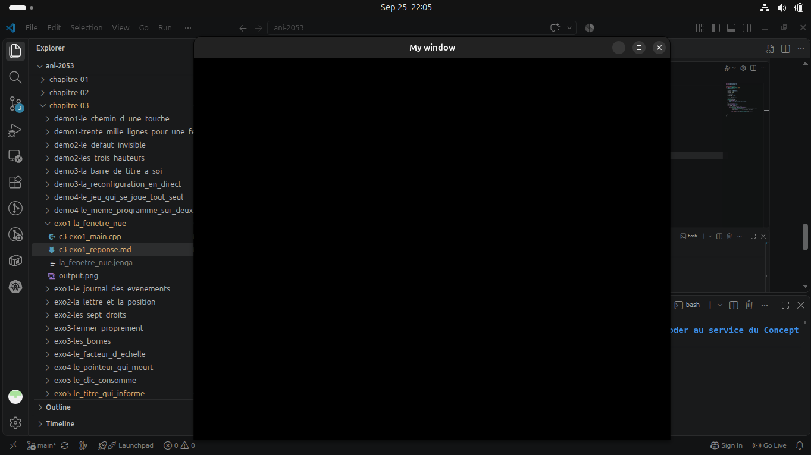

Our program `c3-exo1_main.cpp` has exactly `32 lines` of which :

- We have includes from `line 1 to 2`. These are mentionned in chapter 3 at the smallest valid `NKWindow` program.
``` cpp
    #include "NKWindow/NKWindow.h"
    #include "NKWindow/NKMain.h"
```

- A namespace `nkentseu` at `line 4`. This `namespace` was not explicitly mentionned in the chapter but we know `Nkentseu` works using it.
``` cpp
using namespace nkentseu;
```

- A main function `nkmain()` which provides each platform with it's specific **entry point** : `WinMain` for Windows, `main` for linux, `android_main` for Android etc. This line was mentionned in chapter 3 exactly after the smallest valid `NKWindow` program.

``` cpp
int nkmain(const NkEntryState &state) { ... }
``` 

- A **struct** of type `NKWindowConfig` that stores windows configurations. This configuration datatype was mentionned in chapter 3 exactly after the role played by `nkmain` in our program.
``` cpp
    NkWindowConfig cfg;

    cfg.title  = "My window";
    cfg.width  = 800;
    cfg.height = 640;
``` 

- A window object of type `NKWindow` created with **configs** been passed to it's constructor. We also verify it's created without error. This was mentionned under the section `configuring and managing a window`
``` cpp
    NkWindow window(cfg);
    if (!window.IsOpen()) {
        logger.Error("[app] window creation failed");
        return -1;
    }
``` 

- We then keep the window alive and Handle events. These are mentionned in chapter 3 at the smallest valid `NKWindow` program.
``` cpp
    while (window.IsOpen()) { 
        /* events come here */ 
        while (NkEvent* ev = NkEvents().PollEvent()) {
            // ev points to current event
            if (ev->Is<NkWindowCloseEvent>()) {
                window.Close();
            }
        }
    }
```
### Building and Executing
We use `jenga` for our construction
``` bash
jenga build --target la_fenetre_nue --config Debug

./Build/Bin/Debug-Linux/la_fenetre_nue/la_fenetre_nue
```

#### Result

``` bash
╔══════════════════════════════════════════════════════════════════╗
║                                                                  ║
║                ██╗███████╗███╗   ██╗ ██████╗  █████╗             ║
║                ██║██╔════╝████╗  ██║██╔════╝ ██╔══██╗            ║
║                ██║█████╗  ██╔██╗ ██║██║  ███╗███████║            ║
║           ██   ██║██╔══╝  ██║╚██╗██║██║   ██║██╔══██║            ║
║           ╚█████╔╝███████╗██║ ╚████║╚██████╔╝██║  ██║            ║
║            ╚════╝ ╚══════╝╚═╝  ╚═══╝ ╚═════╝ ╚═╝  ╚═╝            ║
║                                                                  ║
║             Multi-platform C/C++ Build System v2.8.0             ║
║                                                                  ║
╚══════════════════════════════════════════════════════════════════╝

Loading workspace...

Configuration: Debug
Target:        Linux x86_64
Toolchain:     host-clang

Build Order (1 projects):
  1. la_fenetre_nue [WINDOWED_APP]


╔══════════════════════════════════════════════════════════════════════════════════════════════╗
║  Project: la_fenetre_nue                                                 Kind: WINDOWED_APP  ║
╚══════════════════════════════════════════════════════════════════════════════════════════════╝

ℹ Found 1 source file(s)
✓   [1/1] Compiled: c3-exo1_main.cpp
ℹ Linking...
✓ Built: Build/Bin/Debug-Linux/la_fenetre_nue/la_fenetre_nue

┌──────────────────────────────────────────────────────────────────────────────────────────────┐
│  ✓ Build Successful                                                             Time: 2.19s  │
└──────────────────────────────────────────────────────────────────────────────────────────────┘

════════════════════════════════════════════════════════════════════════════════
                                BUILD COMPLETED                                 
════════════════════════════════════════════════════════════════════════════════
Projects Built:  1/1
Time:           2.19s
Status:         ✓ SUCCESS
════════════════════════════════════════════════════════════════════════════════
```

### Output
