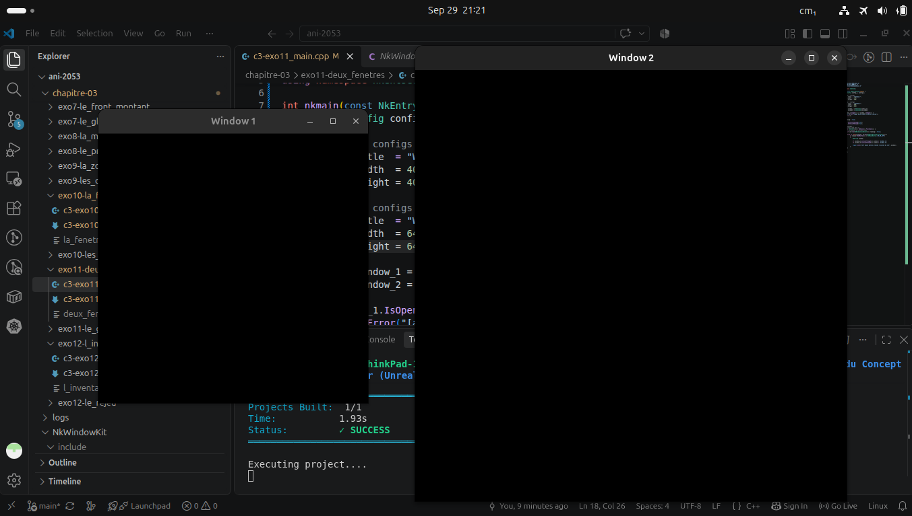

## Introduction

In this we are asked to OPEN two window simultaneously in our program and determine which of the two recieves a `Mouse Button Press` event (click). And say what lacks for us to draw on both windows.

Firstly, our program `c3-exo11_main.cpp` effectively creates two windows from two seperate configurations as seen below, we compile and run using `jenga` 
### Command
``` bash
jenga build --target deux_fenetres --config Debug

./Build/Bin/Debug-Linux/deux_fenetres/deux_fenetres 
```



We use a logger message in order to show our event effectively happened that is the `left mouse` button click and try to determine who recieves it using `IsClickThrough()`

``` cpp
window_1.SetClickThrough(true);
window_2.SetClickThrough(true);

/* Code here */

NkString window;

if (window_1.IsClickThrough()) window = "window 1";
if (window_2.IsClickThrough()) window = "window 2";

logger.Info("left mouse button pressed recieved by {0}", window);
```

## Observation
| **Window** | **Log Message** |
|------------|-----------------|
| `1` | `[2026-09-29 21:24:43.058] [INF] [default] [c3-exo11_main.cpp:47 in nkmain] -> left mouse button pressed recieved by window 2` |
| `2` | `[2026-09-29 21:24:45.833] [INF] [default] [c3-exo11_main.cpp:47 in nkmain] -> left mouse button pressed recieved by window 2`

We can see from the table above each click was recieved by `window 2` because when `SetClickThrough()` is enabled all mouse events on a window travels to the window under it.

Finally, to draw in each window what lacks is a proper rendering system such as OpenGL, Win32 or Vulkan