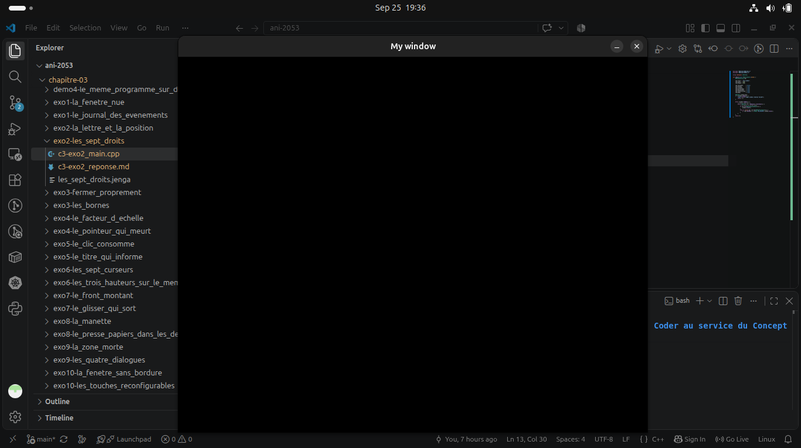

# Exercise 2 - C3

## `main.cpp`

``` cpp
#include "NKWindow/NKWindow.h"
#include "NKWindow/NKMain.h"

using namespace nkentseu;

int nkmain(const NkEntryState &state) {
    NkWindowConfig cfg;

    cfg.title  = "My window";
    cfg.width  = 800;
    cfg.height = 640;

    cfg.resizable     = true;
    cfg.movable       = true;
    cfg.closable      = true;
    cfg.minimizable   = true;
    cfg.maximizable   = true;
    cfg.canFullscreen = true;
    cfg.modal         = true;

    NkWindow window(cfg);
    if (!window.IsOpen()) {
        logger.Error("[app] window creation failed");
        return -1;
    }

    while (window.IsOpen()) { 
        /* events come here */ 
        while (NkEvent* ev = NkEvents().PollEvent()) {
            // ev points to current event
            if (ev->Is<NkWindowCloseEvent>()) {
                window.Close();
            }
            else if (auto* kp = ev->As<NkKeyPressEvent>()) {
                if (kp->GetKey() == NkKey::NK_ESCAPE) window.Close();
            }
        }
    }
    return 0;
}
```

and we build and run this program using `jenga`

``` bash
jenga build --target la_fenetre_nue --config Debug

./Build/Bin/Debug-Linux/les_sept_droits/les_sept_droits
```

## 1 - When `resizable` was `false`

``` cpp
cfg.resizable = false;
```
- **What we expect:** With this configuration set to false, window can't be resized

- **What was observed:** We couldn't resize window



## 2 - When `movable` was `false`

``` cpp
cfg.movable = false;
```
- **What we expect:** The window should not be capable of moving

- **What was observed:** We could still move around with the window

## 3 - When `closable` was `false` 

``` cpp
cfg.closable = false;
```
- **What we expect:** The window can't be closed

- **What was observed:** Window could still be closed

## 4 - When `minimizable` was `false`

``` cpp
cfg.minimizable = false;
```
- **What we expect:** The window can't be minimized

- **What was observed:** We could still minimize window

## 5 - When `maximizable` was `false`

``` cpp
cfg.maximizable = false;
```
- **What we expected:** The window can't be maximized

- **What was observed:** We could still maximize window

## 6 - When `canFullscreen` was `false`

``` cpp
cfg.canFullscreen = false;
```

- **What we expect:** The window can't be fullscreened

- **What was observed:** FullScreen functionned normally


## 7 - When `modal` was `false` 

``` cpp
cfg.modal = false;
```
- **What we expect:** Block other windows while current window is still open

- **What was observed:** We could move to other windows without problem

### Summary

Out of `7` actions users are allowed to do on an `NKWindow` : `resize`, `minimize`, `fullscreen`, `maximize`, `close`, `move` and `mode` only 1 (`resize`) seems to have any effect when set to **false** on Linux (Ubuntu). We guess the remaining actions are in maintenance.