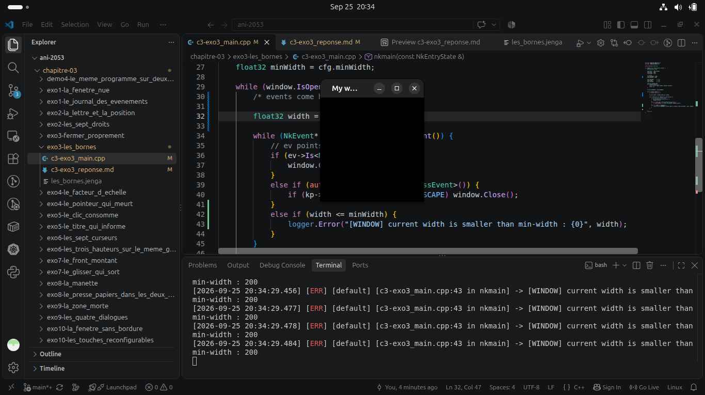
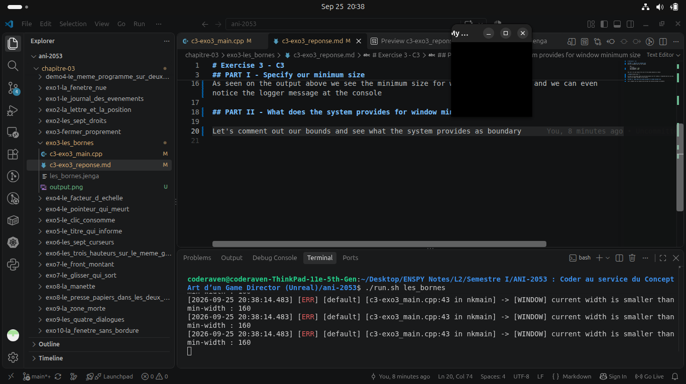

# Exercise 3 - C3

## PART I - Specify our minimum size
We set a minimum size for our window

``` cpp
    // Bounds
    cfg.minHeight = 200;
    cfg.minWidth = 200;
```  

Now let's try and reduce the size of the window manually as below



As seen on the output above we see the minimum size for window is respected and we can even notice the logger message at the console

## PART II - What does the system provides for window minimum size

Let's comment out our bounds and see what the system provides as boundary


From the logger messages at the console we get a minimum size of `160x160` that is set by default by the system (`NKWindow`)