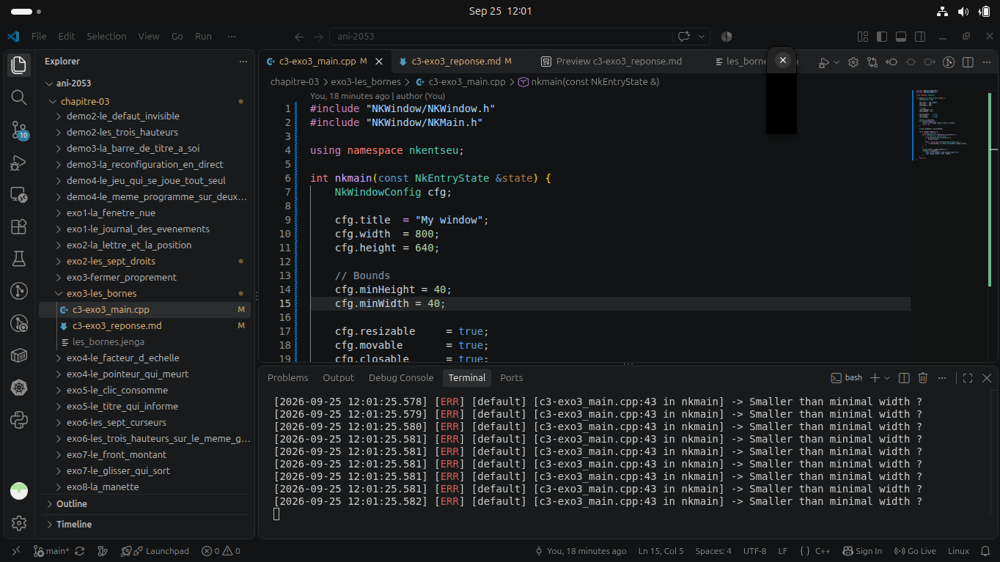

# Exercise 3 - 1

We are to set a minimum size for our window

``` cpp
    // Bounds
    cfg.minHeight = 40;
    cfg.minWidth = 40;
```  

Now let's try and reduce the size of the window manually as below



As seen on the output above we see the minimum size for window is respected and we can even notice that logger message at the console

Also, On my device the smallest size of a window is 1x1.
