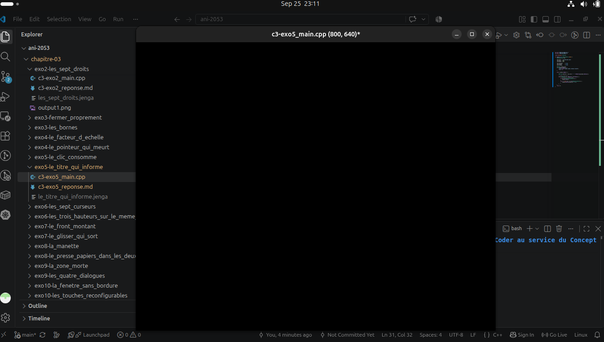

We build and Execute our program using

``` bash
jenga build --target le_titre_qui_informe --config Debug

./Build/Bin/Debug-Linux/le_titre_qui_informe/le_titre_qui_informe 
```

``` bash
# Output
╔══════════════════════════════════════════════════════════════════╗
║                                                                  ║
║                ██╗███████╗███╗   ██╗ ██████╗  █████╗             ║
║                ██║██╔════╝████╗  ██║██╔════╝ ██╔══██╗            ║
║                ██║█████╗  ██╔██╗ ██║██║  ███╗███████║            ║
║           ██   ██║██╔══╝  ██║╚██╗██║██║   ██║██╔══██║            ║
║           ╚█████╔╝███████╗██║ ╚████║╚██████╔╝██║  ██║            ║
║            ╚════╝ ╚══════╝╚═╝  ╚═══╝ ╚═════╝ ╚═╝  ╚═╝            ║
║                                                                  ║
║             Multi-platform C/C++ Build System v2.8.0             ║
║                                                                  ║
╚══════════════════════════════════════════════════════════════════╝

Loading workspace...

Configuration: Debug
Target:        Linux x86_64
Toolchain:     host-clang

Build Order (1 projects):
  1. le_titre_qui_informe [WINDOWED_APP]


╔══════════════════════════════════════════════════════════════════════════════════════════════╗
║  Project: le_titre_qui_informe                                           Kind: WINDOWED_APP  ║
╚══════════════════════════════════════════════════════════════════════════════════════════════╝

ℹ Found 1 source file(s)
✓   [1/1] Compiled: c3-exo5_main.cpp
ℹ Linking...
✓ Built: Build/Bin/Debug-Linux/le_titre_qui_informe/le_titre_qui_informe

┌──────────────────────────────────────────────────────────────────────────────────────────────┐
│  ✓ Build Successful                                                             Time: 1.77s  │
└──────────────────────────────────────────────────────────────────────────────────────────────┘

════════════════════════════════════════════════════════════════════════════════
                                BUILD COMPLETED                                 
════════════════════════════════════════════════════════════════════════════════
Projects Built:  1/1
Time:           1.77s
Status:         ✓ SUCCESS
════════════════════════════════════════════════════════════════════════════════
```

### Before a key is pressed


### After 


### Analysis
Notice in `c3-exo5_main.cpp` we used an Event manager to determine whether the windoww reacted to an `event` (NkKeyPressedEvent) to show our program was in the modified state.

``` cpp
        while (NkEvent* ev = NkEvents().PollEvent()) {
            // ev points to current event
            if (ev->Is<NkWindowCloseEvent>()) {
                window.Close();
            }
            else if (auto* kp = ev->As<NkKeyPressEvent>()) {
                window.SetTitle(newTitle + "*");
            }
        }
```