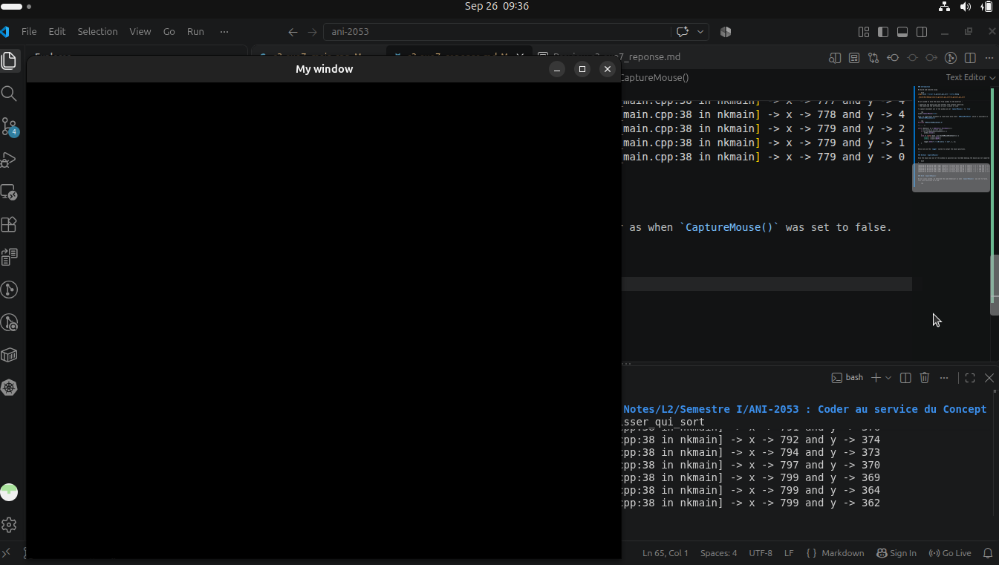

### Introduction

We build and execute using

``` bash
jenga build --target le_glisser_qui_sort --config Debug

./Build/Bin/Debug-Linux/le_glisser_qui_sort/le_glisser_qui_sort
```

We are asked to move the mouse from window to the exterior :

- Capturing the mouse once and another time without capturing
- Then describe the difference on user's point of view 

To capture mouse movement out of window we set `CaptureMouse()` to `true`

``` cpp
window.CaptureMouse(true);
```
Also, To get mouse movements we read mouse move event `NkMouseMoveEvent` which is available in `NKEvent/NKMouseEvent.h`

``` cpp
#include "NKEvent/NkMouseEvent.h"

/* .... */

while (NkEvent* ev = NkEvents().PollEvent()) {
    // ev points to current event
    if (ev->Is<NkWindowCloseEvent>()) {
        window.Close();
    }
    else if (auto* move = ev->As<NkMouseMoveEvent>()) {
        int32 x = move->GetX();
        int32 y = move->GetY();

        logger.Info("x -> {0} and y -> {1}", x, y);
    } 
}
```

Notice we use the `logger` system to output the mouse movement.

---

### Without `CaptureMouse()`

Once the mouse was out of the window no mouse movement was recorded meaning the mouse was not captured

``` bash
# ....

[2026-09-26 09:30:46.550] [INF] [default] [c3-exo7_main.cpp:38 in nkmain] -> x -> 777 and y -> 4
[2026-09-26 09:30:46.558] [INF] [default] [c3-exo7_main.cpp:38 in nkmain] -> x -> 778 and y -> 4
[2026-09-26 09:30:46.580] [INF] [default] [c3-exo7_main.cpp:38 in nkmain] -> x -> 779 and y -> 2
[2026-09-26 09:30:46.610] [INF] [default] [c3-exo7_main.cpp:38 in nkmain] -> x -> 779 and y -> 1
[2026-09-26 09:30:46.700] [INF] [default] [c3-exo7_main.cpp:38 in nkmain] -> x -> 779 and y -> 0
```

### With `CaptureMouse()`

On our Linux system, we obtained the same behaviour as when `CaptureMouse()` was set to false. This could possibly be a bug.



Notice where the cursor was placed and see the mouse movement was not consoled/recorded.

---

### The User's Point of View

When `CaptureMouse()` is set to `true`, Users will notice both mouse movements made in and out of the window will be recorded by the window and When `false` only those made within the window will be recorded.