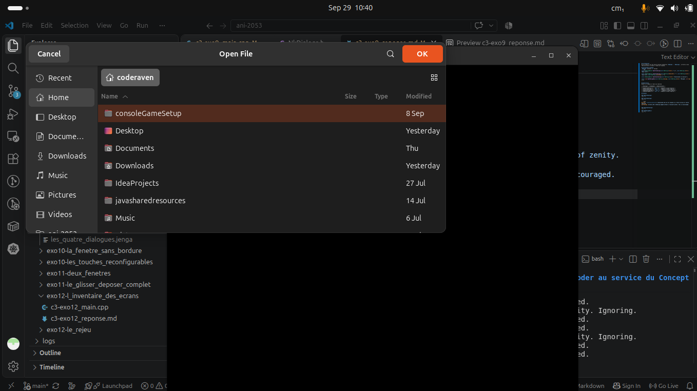
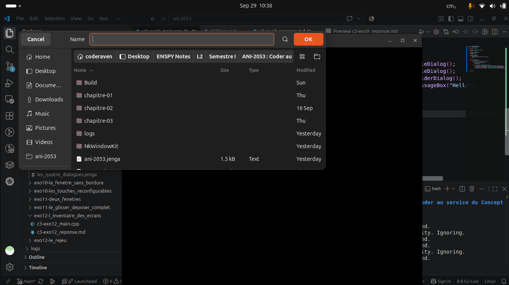
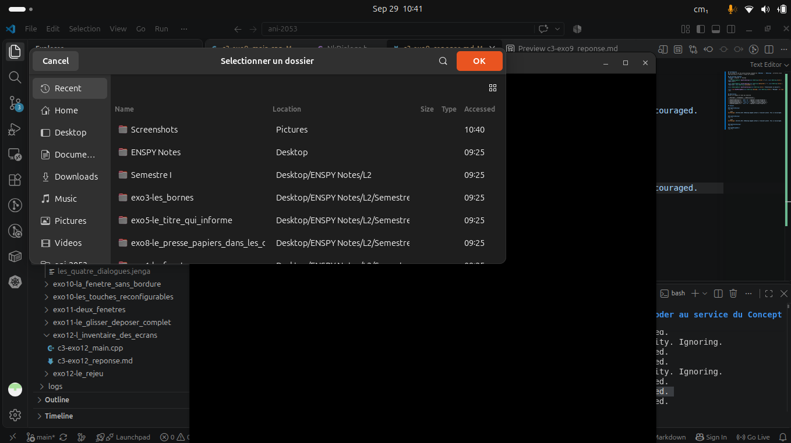
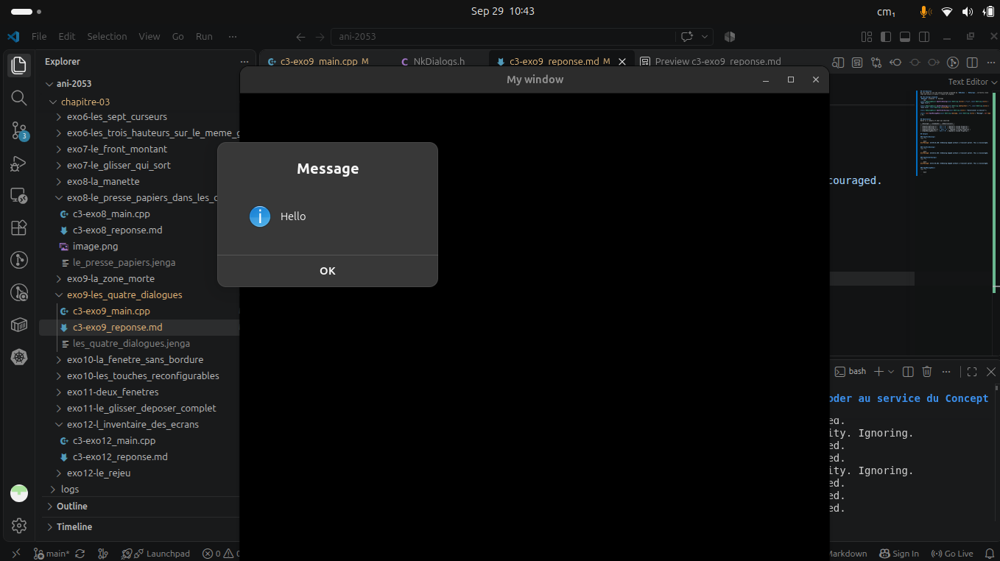

## Introduction
We are asked to use the native dialogs proposed by `NkWindow` : `NkDialogs`, correctly close them and ensure it doesn't freeze our program.

## The Dialogs proposed
`NkWindow` proposes `4` Dialogs 
``` cpp
static NkDialogResult OpenFileDialog(const NkString &filter = "*.*", const NkString &title = "Open File");

static NkDialogResult SaveFileDialog(const NkString &defaultExt = "", const NkString &title = "Save File", const NkString &initialDir = "");

static NkDialogResult OpenFolderDialog(const NkString &title = "Selectionner un dossier");

static void OpenMessageBox(const NkString &message, const NkString &title = "Message", int type = 0);
```

## Observation
Below is a summary of what was observed

| **Dialog** | **Command** | **Observation** |
|------------|-------------|-----------------|
| **OpenFileDialog()** | `Ctrl + O` | *Opened & Closed Properly* |
| **SaveFileDialog()** | `Ctrl + S` | *Opened & Closed Properly* |
| **OpenFolderDialog()** | `Ctrl + F` | *Opened & Closed Properly* |
| **OpenMessageBox()** | `Ctrl + M` | *Opened & Closed Properly* |

## Outputs

### OpenFileDialog()


``` bash
Gtk-Message: 10:40:26.150: GtkDialog mapped without a transient parent. This is discouraged.
```

### SaveFileDialog()


``` bash
Gtk-Message: 10:38:51.454: GtkDialog mapped without a transient parent. This is discouraged.
```

### OpenFolderDialog()


``` bash
Gtk-Message: 10:41:46.201: GtkDialog mapped without a transient parent. This is discouraged.
```

### OpenMessageBox()
